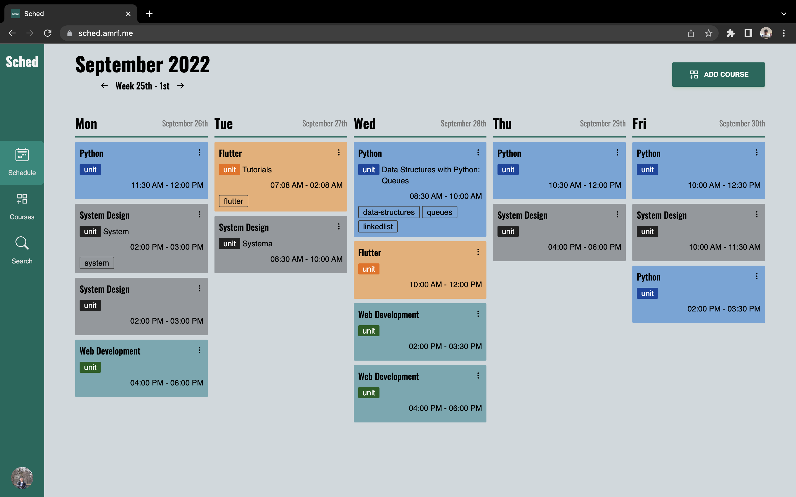

  
  <h1>Sched App</h1>

## Description

Simple class notes app using `Next.js`, `NextAuth`, `TypeScript`, `tRPC`, `Prisma` and `Railway`.

## Project Features

- User able to login via OAuth with `GitHub`, `Twitter`, `Twitch` and `Spotify` providers.
- User can create courses, range of dates for the courses and their weekly schedules (with start time and end time). User able to select some choices of colors for their courses and schedule cards.
- User can edit and delete the existing courses.
- User can add notes to the schedule card using `Markdown`. They can preview the notes, edit, delete.
- Each note can add a list of tags so that can filter/find the schedule cards by tags in the Search page.

## Techstacks

- [Next.js](https://nextjs.org/)
- [TailwindCSS](https://tailwindcss.com/)
- [TailwindCSS-Typography](https://tailwindcss.com/docs/typography-plugin)
- [Next-Auth](https://next-auth.js.org/)
- [TypeScript](https://www.typescriptlang.org/)
- [tRPC](https://trpc.io/)
- [Prisma](https://www.prisma.io/)
- [Railway](https://railway.app/)
- [Vercel](https://vercel.com/)