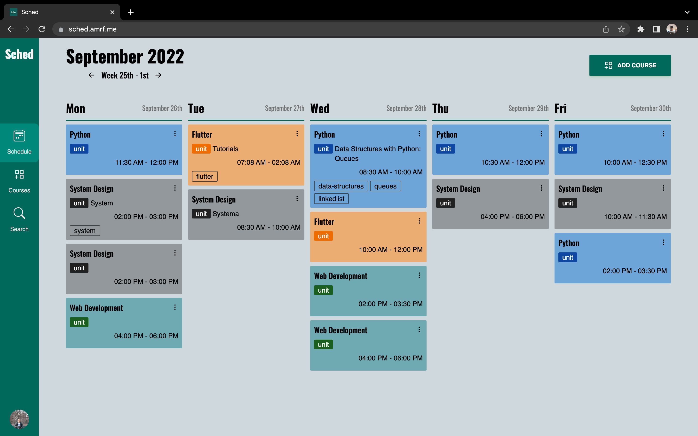

<div align="center">
  
</div>

## Description

Simple schedule-based note taking app (markdown) for students/teachers built using `create-t3-app` --- `Next.js`, `NextAuth`, `TypeScript`, `tRPC`, `Prisma` and `Railway`.



## Quick Links

- [sched.amrf.me](https://sched.amrf.me)

## Goals For This Project

- Use the `create-t3-app` boilerplate
- Using new `Next.js` middleware to handle auth redirects / routes protection
- Setting up multiple OAuth providers with `NextAuth`
- Use `Railway` for `postgresql` hosting
- Render markdown content using `react-markdown` and `@tailwindcss/typography`

## Project Features

- User able to login via OAuth with `GitHub`, `Twitter`, `Twitch` and `Spotify` providers.
- User can create courses and set the duration for the courses
  - For example, students/teachers can create multiple courses and set the duration for 1 semester (6 months or so)
  - Then they can create the weekly schedules for the courses. For example, a student has Mathematics course and the course is from 8AM - 10AM from Monday - Friday. So they can set 5 schedules as their weekly schedules, from Monday - Friday, 8AM - 10AM
- User can view their weekly schedules for the week. User will also be able to select the specific weekly schedules that they want to see
- From the weekly schedule card, user can add the notes for the schedule. The note is rendered in `Markdown`
  - For example, the student add note for the Monday's Mathematics class for that specific week
- In the search tab, user can find any notes based on their tags

## Techstacks

- [create-t3-app](https://create.t3.gg/)
- [Next.js](https://nextjs.org/)
- [TailwindCSS](https://tailwindcss.com/)
- [Material-Tailwind](https://www.material-tailwind.com/)
- [TailwindCSS-Typography](https://tailwindcss.com/docs/typography-plugin)
- [React-Markdown](https://github.com/remarkjs/react-markdown)
- [Next-Auth](https://next-auth.js.org/)
- [TypeScript](https://www.typescriptlang.org/)
- [tRPC](https://trpc.io/)
- [Prisma](https://www.prisma.io/)
- [Railway](https://railway.app/)
- [Vercel](https://vercel.com/)

## Setting Up Locally

- Clone or fork this repository
- To clone:

```bash
git clone https://github.com/amirfakhrullah/sched.git
```

- Set up `.env` vars (refer `.env.sample`)

- Install the dependencies. I'm using `npm` here, so:
```bash
npm i
```

- Running locally
```bash
npm run dev
```